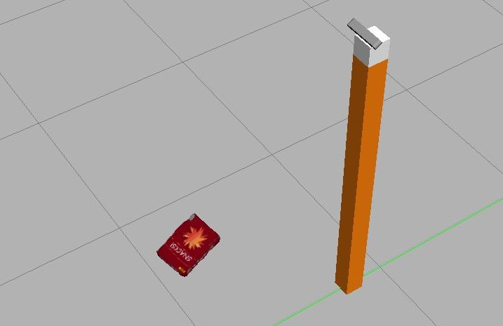
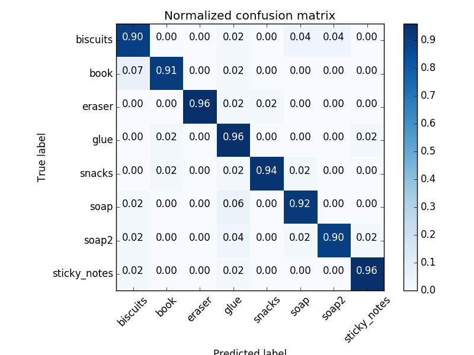
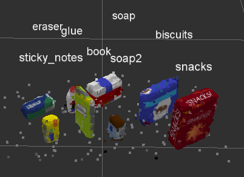

# Project: Perception Pick & Place

The present repository is my solution to [Udacity Robotics Nanodegree Perception Project](https://github.com/udacity/RoboND-Perception-Project.git).

---

## Required Steps for a Passing Submission:
1. Extract features and train an SVM model on new objects (see `pick_list_*.yaml` in `/pr2_robot/config/` for the list of models you'll be trying to identify). 
2. Write a ROS node and subscribe to `/pr2/world/points` topic. This topic contains noisy point cloud data that you must work with.
3. Use filtering and RANSAC plane fitting to isolate the objects of interest from the rest of the scene.
4. Apply Euclidean clustering to create separate clusters for individual items.
5. Perform object recognition on these objects and assign them labels (markers in RViz).
6. Calculate the centroid (average in x, y and z) of the set of points belonging to that each object.
7. Create ROS messages containing the details of each object (name, pick_pose, etc.) and write these messages out to `.yaml` files, one for each of the 3 scenarios (`test1-3.world` in `/pr2_robot/worlds/`).  [See the example `output.yaml` for details on what the output should look like.](https://github.com/udacity/RoboND-Perception-Project/blob/master/pr2_robot/config/output.yaml)  
8. Submit a link to your GitHub repo for the project or the Python code for your perception pipeline and your output `.yaml` files (3 `.yaml` files, one for each test world).  You must have correctly identified 100% of objects from `pick_list_1.yaml` for `test1.world`, 80% of items from `pick_list_2.yaml` for `test2.world` and 75% of items from `pick_list_3.yaml` in `test3.world`.
9. Congratulations!  Your Done!

## Extra Challenges: Complete the Pick & Place
7. To create a collision map, publish a point cloud to the `/pr2/3d_map/points` topic and make sure you change the `point_cloud_topic` to `/pr2/3d_map/points` in `sensors.yaml` in the `/pr2_robot/config/` directory. This topic is read by Moveit!, which uses this point cloud input to generate a collision map, allowing the robot to plan its trajectory.  Keep in mind that later when you go to pick up an object, you must first remove it from this point cloud so it is removed from the collision map!
8. Rotate the robot to generate collision map of table sides. This can be accomplished by publishing joint angle value(in radians) to `/pr2/world_joint_controller/command`
9. Rotate the robot back to its original state.
10. Create a ROS Client for the “pick_place_routine” rosservice.  In the required steps above, you already created the messages you need to use this service. Checkout the [PickPlace.srv](https://github.com/udacity/RoboND-Perception-Project/tree/master/pr2_robot/srv) file to find out what arguments you must pass to this service.
11. If everything was done correctly, when you pass the appropriate messages to the `pick_place_routine` service, the selected arm will perform pick and place operation and display trajectory in the RViz window
12. Place all the objects from your pick list in their respective dropoff box and you have completed the challenge!
13. Looking for a bigger challenge?  Load up the `challenge.world` scenario and see if you can get your perception pipeline working there!

## [Rubric](https://review.udacity.com/#!/rubrics/1067/view) Points
### Here I will consider the rubric points individually and describe how I addressed each point in my implementation.  

---
### Writeup / README

#### 1. Provide a Writeup / README that includes all the rubric points and how you addressed each one.  You can submit your writeup as markdown or pdf.  

You're reading it!

### Exercise 1, 2 and 3 pipeline implemented
#### 1. Complete Exercise 1 steps. Pipeline for filtering and RANSAC plane fitting implemented.

Steps have been completed in `project_template.py`:
- a statistical outlier filter has been added in order to remove part of the noise
- then the space has been divided into voxels for faster processing
- a passthrough filter has been used on z-axis and y-axis to remove the points below the table as well as the ones coming from the side boxes
- RANSAC plane fitting has been used to isolate the tabl, which let us extract the objects on it.

#### 2. Complete Exercise 2 steps: Pipeline including clustering for segmentation implemented.

Steps have been completed in `project_template.py`:
- euclidean clustering model has been used
- tolerances as well as target size has been refined through trial and error. The tolerance is related to the distance of the points belonging to a same cluster while the target size is used to identify the number of elements needed to form a cluster.

#### 2. Complete Exercise 3 Steps.  Features extracted and SVM trained.  Object recognition implemented.

We capture the objects of interest in front of the camera in random position and orientation, and use the point cloud data to create color and normal histograms. Those are used to define the features associated with the objects.

Once we have created features in different orientation for all the objects, we train a SVM classifier and ensure our features are well chosen by verifying the confusion matrix.

### Pick and Place Setup

#### 1. For all three tabletop setups (`test*.world`), perform object recognition, then read in respective pick list (`pick_list_*.yaml`). Next construct the messages that would comprise a valid `PickPlace` request output them to `.yaml` format.

We use our classifier to identify each cluster.

While it is not difficult to identify 3 objects (in the test world 1), it becomes much more difficult to identify 8 objects as some are similar and not all are well positioned (for example the glue). Here are a few outlines:
- the size of voxels need to be small enough, as well as the histogram bins, in order to have enough detail on the object color to reach a good classification
- the more orientation samples are taken to extract the features, the better will be the accuracy of the classifier
- noise need to be removed in order to improve predictions
- the side bins can be recognized during clustering process and need to be filtered out

The message is straightforward to construct once the voxels have been correcly identified. The object centroid can be calculated and its corresponding bin color is used to pick the correct and correct target position.

The yaml messages for each test environment can be found in the folder `yaml_output`.