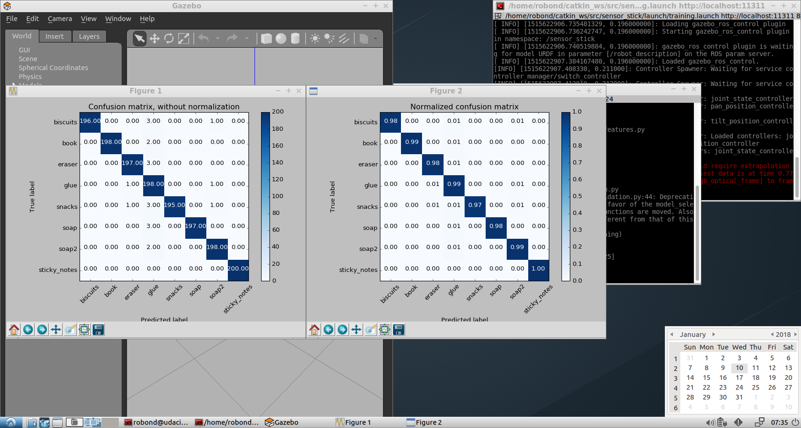
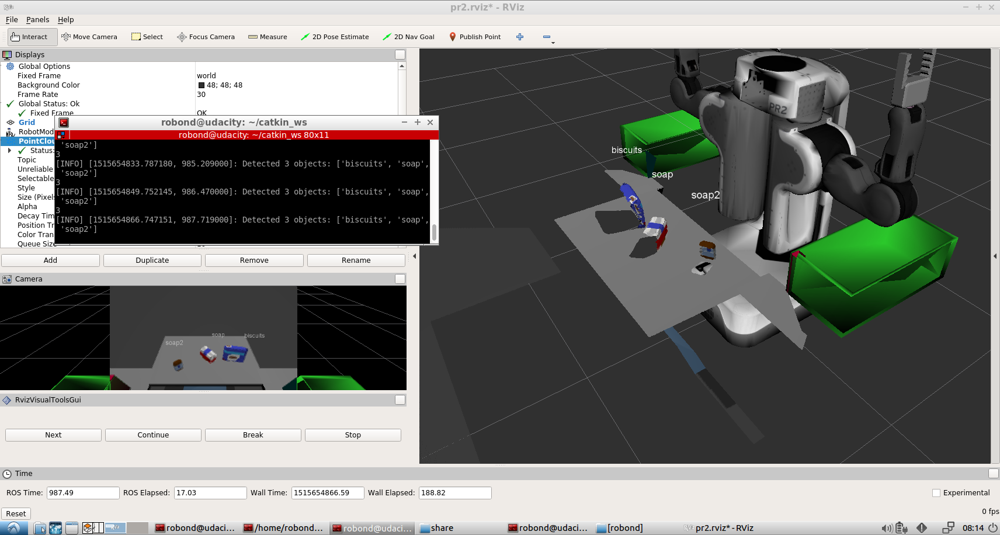
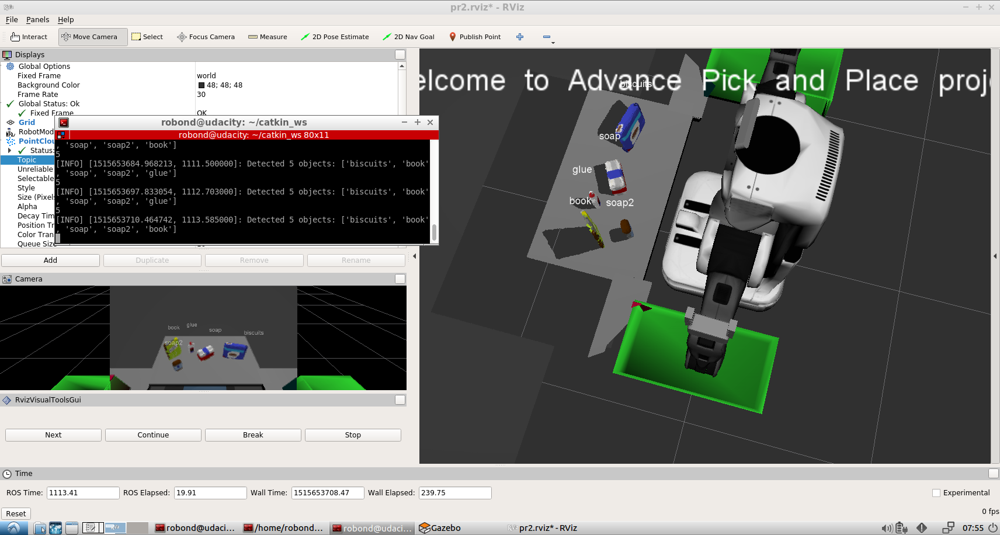

# Project: Perception Pick & Place

---

## [Rubric](https://review.udacity.com/#!/rubrics/1067/view) Points
Here I will consider the rubric points individually and describe how I addressed each point in my implementation.  

Note: I have been helped through the Udacity Slack.

---

### Writeup / README

#### 1. Provide a Writeup / README that includes all the rubric points and how you addressed each one.  You can submit your writeup as markdown or pdf.  

You're reading it!

As asked in the review, I have improved my writeup with:
- detailed explanation
- code snippets
- discussion about results
- problems faced with their solution


### Exercise 1, 2 and 3 pipeline implemented
#### 1. Complete Exercise 1 steps. Pipeline for filtering and RANSAC plane fitting implemented.

The pipeline has been correctly implemented, as reviewed.

To avoid the camera noise problems, a filtering is applied. The values are chosen by tries and results observation (publishing an intermediate "debug_cloud").

```python
## Statistical Outlier Filtering
outlier_filter = cloud.make_statistical_outlier_filter()

# Set the number of neighboring points to analyze for any given point
outlier_filter.set_mean_k(50)

# Set threshold scale factor
x = 0.5

# Any point with a mean distance larger than global (mean distance+x*std_dev) will be considered outlier
outlier_filter.set_std_dev_mul_thresh(x)

# Finally call the filter function for magic
cloud_filtered = outlier_filter.filter()
```

Similarly, a Downsampling filter is applied, with values chosen by tries and observations in the camera results. Too small leaf size means too much details (heavy) and too big means too simplistic (not performant), as in the course exercise.
```python
# Voxel Grid Downsampling
vox = cloud_filtered.make_voxel_grid_filter()
LEAF_SIZE = 0.01
vox.set_leaf_size(LEAF_SIZE, LEAF_SIZE, LEAF_SIZE)
cloud_filtered = vox.filter()
```
Similarly, a PassThrough filter is applied. Values are also chosen by tries and observation of an intermediate debug_cloud in the visualisation.
```python
# PassThrough Filter
passthrough = cloud_filtered.make_passthrough_filter()
passthrough.set_filter_field_name('z')
passthrough.set_filter_limits(0.6, 1.3)
cloud_filtered = passthrough.filter()

passthrough2 = cloud_filtered.make_passthrough_filter()
passthrough2.set_filter_field_name('y')
passthrough2.set_filter_limits(-0.4, 0.4)
cloud_filtered = passthrough2.filter()

passthrough3 = cloud_filtered.make_passthrough_filter()
passthrough3.set_filter_field_name('x')
passthrough3.set_filter_limits(0.4, 0.9)
cloud_filtered = passthrough3.filter()

```

Finally, a RANSAC Plane Segmentation is done to distinguish the points on a plane called inliers (the table), and the others called outliers, as in the course.

```python
# RANSAC Plane Segmentation
seg = cloud_filtered.make_segmenter()
seg.set_model_type(pcl.SACMODEL_PLANE)
seg.set_method_type(pcl.SAC_RANSAC)
max_distance = 0.01
seg.set_distance_threshold(max_distance)
inliers, coefficients = seg.segment()

# Extract inliers and outliers
extracted_inliers = cloud_filtered.extract(inliers, negative=False)
extracted_outliers = cloud_filtered.extract(inliers, negative=True)
```


#### 2. Complete Exercise 2 steps: Pipeline including clustering for segmentation implemented.  

The pipeline has been correctly implemented, as reviewed.

First of all, we ignore the colors to focus on position, which is what delimits points clouds of each object separately.
```python
# Euclidean Clustering
white_cloud = XYZRGB_to_XYZ(extracted_outliers)
```

Then, the clustering is applied as in Exercise. The values were tested by test and tries. Understanding the parameters help to choose them correctly:
- ClusterTolerance: define the distance tolerated ("how far") between two points to consider it is still in the same group
- MinClusterSize: smallest cluster possible (too small: too many clusters are found, too big: objects are not recognized individually)
- MaxClusterSize: biggest cluster possible (too small: objects are too big, therefore rejected, too big: two objects can merge in one cluster)

```python
tree = white_cloud.make_kdtree()
# Create Cluster-Mask Point Cloud to visualize each cluster separately
# Create a cluster extraction object
ec = white_cloud.make_EuclideanClusterExtraction()
# Set tolerances for distance threshold
# as well as minimum and maximum cluster size (in points)
# NOTE: These are poor choices of clustering parameters
# Your task is to experiment and find values that work for segmenting objects.
ec.set_ClusterTolerance(0.01)
ec.set_MinClusterSize(200)
ec.set_MaxClusterSize(15000)
# Search the k-d tree for clusters
ec.set_SearchMethod(tree)
```
#### 3. Complete Exercise 3 Steps.  Features extracted and SVM trained.  Object recognition implemented.
The pipelines have been correctly implemented, as reviewed (capture_features, features and train_svm.py).

For capture_features:
- I faced a problem that depending on the object apparition angles, some were not recognized, and relaunching made them recognizable but other would not. By increasing the number of iterations to 50, this problem disappear (all faces appear at least at some iterations)
- Object list was updated considering the scene objects in the world files.

For features:
- A color and a normal histograms are used, as in the course.

To train the SVM, I did:
`roslaunch sensor_stick training.launch` (launch the scene) followed by `rosrun sensor_stick capture_features.py` (launch the objects features capturing by generating objects at different angles in front of the camera) and after `rosrun sensor_stick train_svm.py` to train the SVM.

A confusion matrix is generated.

The left one (absolute number) is not very relevant as they were as many iterations of each object. (Otherwise, percentage-view would hide the fact that some object would appear only once contrary to other thousands of time, which would bias the model towards the second one. It is not the case here as there are as many iterations of each object).
The right one (relative values, percentage if multiplied by 100) is easier to read and independent of the iterations number. The ideal case is to have 100% in all the diagonal, as the diagonal are the "Good object conclusions" ones (although 100% would probably be overfitting, which is partially avoided by cross-validation).

### Pick and Place Setup

#### 1. For all three tabletop setups (`test*.world`), perform object recognition, then read in respective pick list (`pick_list_*.yaml`). Next construct the messages that would comprise a valid `PickPlace` request output them to `.yaml` format. + You can add this functionality to your already existing ros node or create a new node that communicates with your perception pipeline to perform sequential object recognition. Save your PickPlace requests into output_1.yaml, output_2.yaml, and output_3.yaml for each scene respectively. Add screenshots in your writeup of output showing label markers in RViz to demonstrate your object recognition success rate in each of the three scenarios. Note: for a passing submission, your pipeline must correctly identify 100% of objects in test1.world, 80% (4/5) in test2.world and 75% (6/8) in test3.world.


```python
roslaunch pr2_robot pick_place_project.launch
rosrun pr2_robot project.py
```

Object detection is done thanks to the classifier predict on the clusters previously found in the scene (see previous questions).
We loop through the clusters by `for index, pts_list in enumerate(cluster_indices):` and compute the features as for the capture_features in the previous question. Based on this, we have the known training data which have trained the model, and we use this model to classify unknown clusters with `prediction = clf.predict(scaler.transform(features.reshape(1, -1)))`.

The predictions are stored in the `DetectedObject` list `detected_objects` which is then sent to the `pr2_mover` function.

This function loop through the `object_list`/`detected_objects` and get the position (x-y-z means  of the point cloud). We look in the `/object_list` publication where (which dropbox) the object is supposed to go (depending on its name). Then, depending on that dropbox, we look in the `/dropbox` publication which arm should be used.


Finally, the object and its caracteristics (arm, initial position, dropbox goal...) are made translated to Yaml with `make_yaml_dict` and appended to a yaml_dict list which is saved in a .yaml file with `send_to_yaml`.

Results:
World 1: 100%
World 2: 100%
World 3: 87%




### Improvements, general problems
- The Extra Bonus steps suggested by the course would be interesting to implement, and will be (outside of the mandatory deadlines, though)
- Oriented-Object Programming would be an improvement to the readability of the code
- I have excessively annoying issues with gazebo and Rviz. I must re-launch them dozens of time before having a correct session (without error code in the Gazebo/Rviz launching)
- The laptop ressources are very limited for this application.
