# Follow Me Writeup

As part of the **Follow Me** project, I was able to build, train, validate, and deploy a *segmentation network*. The goal of the network was to take in streaming camera data and output the location (in the image) of a target individual called the **hero**. The outputted data was then used by a pre-built quad-copter controller to follow the hero.

For this project we were required to do three things:

1. Create an FCN (see section [Network Architecture](#network-architecture)).
2. Generate data for training the FCN (see section [Gathering Data](#gathering-data)).
3. Train the FCN and achieve at least **0.4** for the final IoU accuracy (see section [Network Training](#network-training)).


## Network Architecture

For this project, we were asked to implement a [**fully convolutional network (FCN) for semantic segmentation**](https://arxiv.org/pdf/1605.06211v1.pdf). Effectively, an FCN will *recolor* an input image such that any pixels belonging to a specific class are colored the same. Take the following image for example:

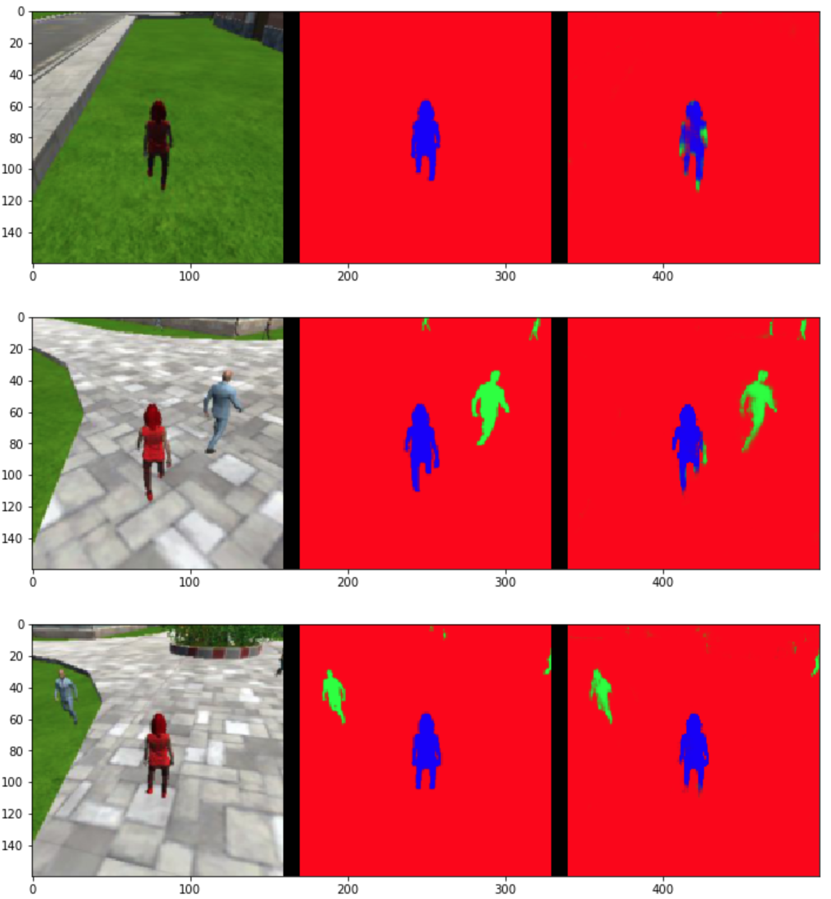

In this image, the **hero** is colored blue. Notice how in the original image, the hero is wearing a noticeable red color. The FCN is not *told* this, but it can implicitly figure it out through a gradient-descent based training process that requires labeled training data. In this way, you could easily select a different hero (e.g., the gray individual in the middle row) and retrain the network using different training data. It is also worth pointing out that in the above image, the middle column denotes *ideal* results and the right column is the output of my FCN. As for coloring, it only matters so much in that the FCN identifies pixels that belong to the background (red), to bystanders (green), and to the hero (blue); it does not actually generate RGB images.

One key component of an FCN is that the output is the same size as the input. Essentially, we perform a softmax for each pixel to determine its final class. **This enables an FCN to maintain spatial information in the final output.** This is the most important aspect of this type of network when compared to a network with fully-connected layers. It enables you to find a target object, and **know something about its location in the original scene**.

<!-- Unlike a standard deep network, which typically has several convolutional layers followed by a fully-connected network. The fully-connected layer "flattens the scene" by connecting every neuron in the layer to every neuron in the next layer. In doing so, there is no way for the network to retain positional information.  -->

The image below (taken from Shelhamer et al, linked above) is the standard depiction of an FCN.


To explain our FCN it will be best to start with the code:

```python
def encoder_block(input_layer, filters, strides):
    return separable_conv2d_batchnorm(input_layer, filters, strides)

def decoder_block(small_ip_layer, large_ip_layer, filters):

    # Upsample the small input layer using the bilinear_upsample() function.
    upsampled_ip_layer = bilinear_upsample(small_ip_layer)

    # Concatenate the upsampled and large input layers using layers.concatenate
    concatenated_layer = layers.concatenate([upsampled_ip_layer, large_ip_layer])

    # Add some number of separable convolution layers
    output_layer1 = separable_conv2d_batchnorm(concatenated_layer, filters)
    output_layer2 = separable_conv2d_batchnorm(output_layer1, filters)
    output_layer3 = separable_conv2d_batchnorm(output_layer2, filters)

    # To reduce the number of layers I can change output_layer3 to 1 or 2
    output_layer = output_layer3

    return output_layer

def fcn_model(inputs, num_classes):

    # Strides for the encoder and decoder layers
    strides_cnt = 2

    # Number of filters for each layer of the encoders and decoders
    filt_cnt1 = 32
    filt_cnt2 = 64
    filt_cnt3 = 128
    filt_cnt4 = 256

    # Add Encoder Blocks.
    # Remember that with each encoder layer, the depth of your model (the number of filters) increases.
    #     encoder_block(input_layer, filters, strides)
    conv_encoder1 = encoder_block(inputs, filt_cnt1, strides_cnt)
    conv_encoder2 = encoder_block(conv_encoder1, filt_cnt2, strides_cnt)
    conv_encoder3 = encoder_block(conv_encoder2, filt_cnt3, strides_cnt)


    # Add 1x1 Convolution layer using conv2d_batchnorm().
    #     conv2d_batchnorm(input_layer, filters, kernel_size=3, strides=1)
    conv1x1 = conv2d_batchnorm(conv_encoder3, filt_cnt4, 1, 1)


    # Add the same number of Decoder Blocks as the number of Encoder Blocks
    #     decoder_block(small_ip_layer, large_ip_layer, filters)
    conv_decoder1 = decoder_block(conv1x1, conv_encoder2, filt_cnt3)
    conv_decoder2 = decoder_block(conv_decoder1, conv_encoder1, filt_cnt2)
    conv_decoder3 = decoder_block(conv_decoder2, inputs, filt_cnt1)

    # Changing the number of encoders/decoders above must be done by hand...
    x = conv_decoder3

    # The function returns the output layer of your model. "x" is the final layer obtained from the last decoder_block()
    return layers.Conv2D(num_classes, 1, activation='softmax', padding='same')(x)
```

### Encoders

As discussed in the lessons, our FCN starts with **separable convolutions** acting as *encoders*. Separable convolutions significantly reduce the complexity of a neural network layer, and therefore reduce the training required. In the code above I have used three encoder blocks and three decoder blocks. In general, the more encoder layers the more complex the shape that the FCN will be able to recognize. For example, the first layer might only discern lines and colors, while the subsequent layers will be able to combine lines and colors into shapes and eventually more intricate concepts like a face.

However, this increase in ability comes with two important costs: first, more layers means more parameters to train, and second, it is possible to **overfit** the training data with a larger network. Overfitting can occur when the network is so large that certain pathways can specialize over certain types of input images scene during training. The end result of overfitting is that you can have a network that performs very well during training, but does not perform well when given novel inputs.

To discuss FCN encoders (and separable convolutions) in more detail I will first need to define a few terms:

- **kernel size**: the "field-of-view" of the filter (how many pixels does each filter neuron see)
- **stride (S)**: a step size for the kernel (impacts the number of neurons in the filter)
- **padding (P)**: how the border of the input is handled (zero padded or cropped)

These parameters dictate the size of a convolutional layer. If the kernel is separable, we can filter in two one-dimensional steps instead of in one two-dimensional step. The result is a moderate savings in computational cost and a large savings in training costs. Specifically, consider the following example from Lesson 6 Part 8:

>Suppose we have an input shape of 32x32x3. With the desired number of 9 output channels and filters (kernels) of shape 3x3x3. In the regular convolutions, the 3 input channels get traversed by the 9 kernels. This would result in a total of 9*3*3*3 features (ignoring biases). That's a total of 243 parameters. In case of the separable convolutions, the 3 input channels get traversed with 1 kernel each. That gives us 27 parameters (3*3*3) and 3 feature maps. In the next step, these 3 feature maps get traversed by 9 1x1 convolutions each. That results in a total of 27 (9*3) parameters.

### The 1x1 Convolution Layer

After the three encoder blocks is a single 1x1 convolution layer. The most direct result of including this layer is a reduction in dimensionality. Since the size of the kernel is 1x1, the layer is guaranteed to maintain the same shape of the input size. However, since we can have fewer filters in this layer than we have features in previous layers, we end up with fewer dimensions being fed into the decoders, which are discussed next. The 1x1 convolutional layer achieves its dimensionality reduction using a concept known as **pooling**. Effectively, features from previous layers are combined by this layer. It is also worth noting, that in general, 1x1 convolution layers can be *sandwiched* between other layers to reduce dimensionality.

The result of the encoder and 1x1 convolution layers (when compared to more traditional approaches) is that the network *retains* spatial information in this deeper middle layer.

### Decoders

After the input has been encoded into the deep middle layer, it must be upsampled back into the original image size via *decoding*. This is done through **bilinear upsampling**, which is a simple process uses linear interpolation to fill in the blanks. Consider a 2x2 output being upsampled to 4x4. The four corners of the 4x4 layer could be directly taken as the 2x2 data. The values between these are linearly interpolated (weighted based on their distance from a known value).

Decoding, however, does more than just upsampling. In fact, the decoding process can be thought of as the network **interpreting** the features found by the previous layers. For example, the encoders might detect features that signify eyes and a mouth, but the decoder is responsible for recognizing these features and outputting that a certain set of pixels belong to a *face*. In effect, the decoder tells us the classification of each pixel.

One additional technique that is employed during decoding is called **layer concatenation**. This technique is similar to **skip connection** in which connections from early layers can be directly connected to final layers without going through the middle layers. In layer concatenation, the output of an encoder can be combined with the output of a decoder. This will enable the network to retain even more spatial information if that leads to reduced error.

Finally, from the code above we can see that decoders are also created using separable convolution layers (though, each decoder comprises three layers). This will, again, save us in training costs.

### Summary of Architecture

As stated earlier (and as can be seen in the code) the final output for each pixel is taken as a softmax among all possible classes: background, bystander, hero. One final note, all of the aforementioned layers use **batch normalization**. This is a technique by which the output of a layer (or, the input to the next layer) is normalized. This technique has shown to improve the ability of a network to be trained. As with the input layer, when you normalize the input into any layer you reduce the chance of the gradient becoming saturated. That is, the gradient is steep enough that the network weights are actually updated instead of becoming stagnant.

Overall, this approach has several advantages over similar techniques. For one, the nonlinearity of the network means that the original image can be segmented into any irregular shapes. FCNs for image segmentation can also build upon the large amount of literature covering different deep neural networks for other tasks. The process of training a neural network is also quite general. Domain specific knowledge obviously helps, but if you can generate adequate training data you can typically use a standard FCN configuration and get reasonable results.

The downsides of an FCN are also quite apparent. First, they require suitable training data; you would not expect an FCN to *learn on the fly*. Second, also it is possible to quickly get reasonable results, it is quite costly to finely tune the FCN hyperparameters. And even if you finely tune the parameters you are likely only worsening the problem of overfitting.

##Gathering Data

The images below show screenshots from my training data environments. In these environments, I focused on having the hero zigzag through different types of terrain (including roads and the red tree) while also moving through dense crowds of people. While recording, I also made sure to record training data in both follow and patrol modes. The bottom line is that I generated four sets of data: one training set and one validation set for each environment.

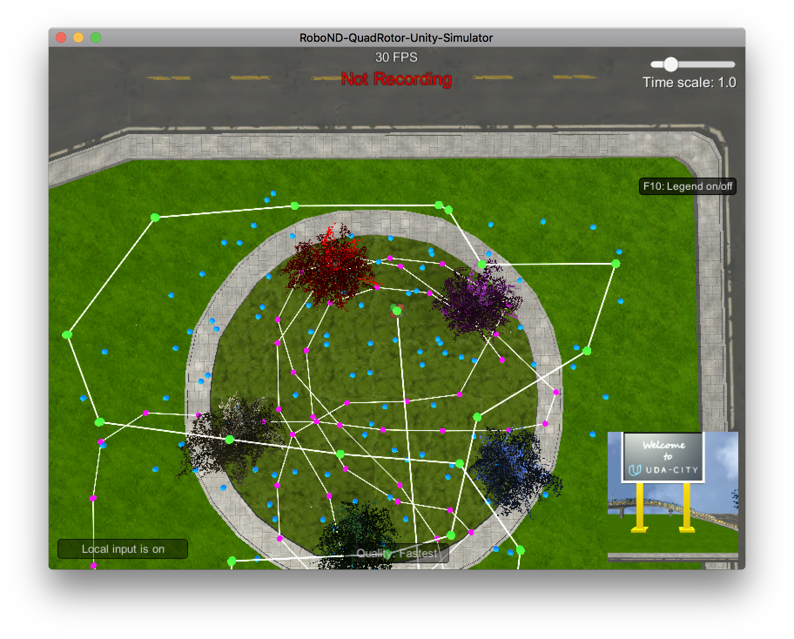

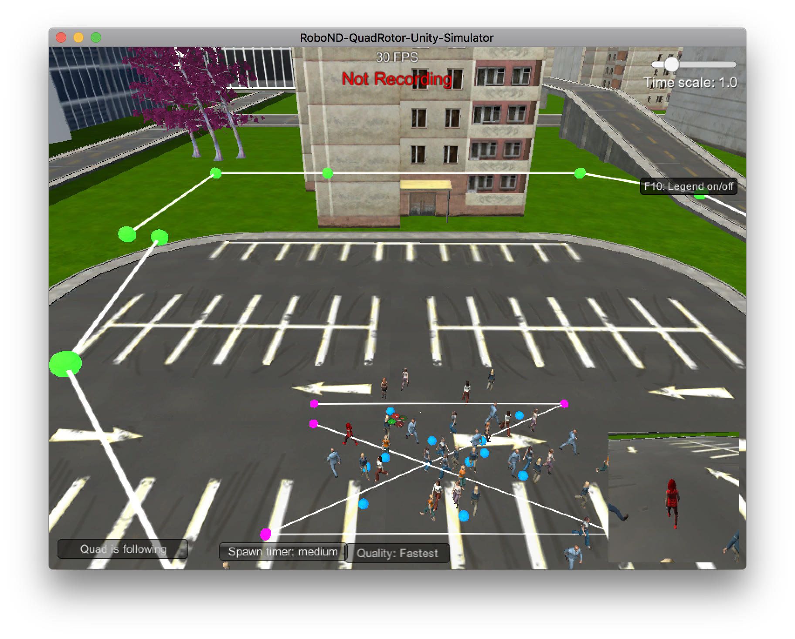

I let the simulator record images until I had roughly 4k for training and 1.5k for validating. Though, after running the script these numbers were drastically cut down.

## Network Training

I first started configuring the network and its hyperparameters by working in a Jupyter Notebook and running the full training algorithm for a limited number of epochs. Specifically, I was configuring the following parameters:

- **Epoch**: the number of times through the entire input
- **Learning Rate**: a scaling factor for how much each weight can be updated
- **Batch Size**: the number of samples to use for a single backward error propagation
- **Steps Per Epoch**: the number of batches to run through the network in one epoch
- **Validation Steps**: the number of batches to run through the network in one epoch during validation
- **Workers**: number of processes to spawn

The text below shows how I settled on my value for the learning rate. Note: were are trying to minimize loss.

```text
# loss: 0.0578 - val_loss: 0.1033
learning_rate = 0.1
batch_size = 10
num_epochs = 3

# loss: 0.0457 - val_loss: 0.0516
learning_rate = 0.01
batch_size = 10
num_epochs = 3

# loss: 0.0442 - val_loss: 0.0508
learning_rate = 0.001
batch_size = 10
num_epochs = 3

# loss: 0.0462 - val_loss: 0.0445
learning_rate = 0.0001
batch_size = 10
num_epochs = 3

# loss: 0.0430 - val_loss: 0.0506
learning_rate = 0.0005
batch_size = 10
num_epochs = 3

# loss: 0.0422 - val_loss: 0.0558
learning_rate = 0.0001
batch_size = 50
num_epochs = 10
```

After some initial exploration on my local machine, I moved to the AWS. The GPU cluster is able to run, on average, 10 epochs per hour depending on the parameters chosen above. On AWS, I used the following commands to setup my environment:

```bash
# log into the AWS machine with SSH

# Clone the project repository
git clone https://github.com/udacity/RoboND-DeepLearning-Project.git
cd RoboND-DeepLearning-Project/data/

#
# Copy the needed training data provided by Udacity
#
wget https://s3-us-west-1.amazonaws.com/udacity-robotics/Deep+Learning+Data/Lab/train.zip
unzip train
mv train_combined train

wget https://s3-us-west-1.amazonaws.com/udacity-robotics/Deep+Learning+Data/Lab/validation.zip
unzip validation.zip

wget https://s3-us-west-1.amazonaws.com/udacity-robotics/Deep+Learning+Data/Project/sample_evaluation_data.zip
unzip sample_evaluation_data.zip

#
# OR, upload new training data from my local machine
#
rsync -rave "ssh -i ../RoboND.pem" validation ubuntu@***-**-***-**-**.us-east-2.compute.amazonaws.com:~/RoboND-DeepLearning-Project/data/

# Run the Jupyter notebook and access through a browser
jupyter notebook --ip='*' --port=8888 --no-browser

```

The `jupyter` command enables me to log onto the Jupyter Notebook via my browser. From there I was able to try several different network configurations. Out of all six parameters, I saw the most difference while adjusting the learning rate and the batch size. It appears that as long as I run for at least 8 epochs I am able to achieve the clost to the best results possible regardless of the other parameters. In the end, the following values ended up giving the best results:

- **Epoch** (20): I tried several different values, but any number over 8 appeared to give similar results.
- **Learning Rate** (0.01): Again, several values were chosen, and values less than or equal to 0.001 gave similar results (but lead to different amounts of required time to converge).
- **Batch Size** (40): I generally received better results by increasing this value, however, any value over 150 caused an error that did not given any sort of meaningful information. Based on what this value does I assume it has something to do with the amount of memory required or floating-point accuracy. I ended up with a value of 40 as it gave the based balance between time and score.
- **Steps Per Epoch** (200): Increasing this value increased the running time and had diminishing returns on performance. Decreasing this value from 200 resulted in worse performance.
- **Validation Steps** (50): Same story for this value.
- **Workers** (20): Theoretically, this should speed up training linearly. However, in practice I didn't notice much speed up past 5.

These values resulted in a training loss and validation loss of 0.0128 and 0.0188, respectively. It also resulted in a final score of **0.435384470236**. The figure below depicts convergence for my best result:

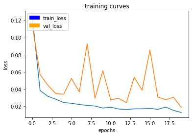

And the following image show the validation values:

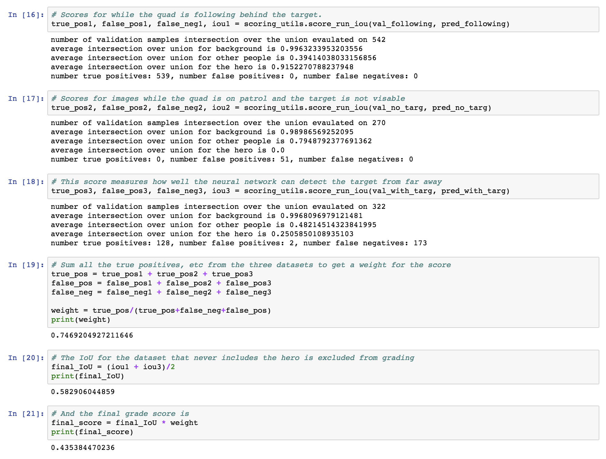

In the first figure you can see that I trained the network for 20 epochs, but there is only mild improvement after approximately the 8th epoch. The gif below shows how well the model works when used by the simulator.


```bash
# The gif was created as follows
ffmpeg -i following.mov -vf scale=1024:-1 -r 1 output/ffout%3d.png
convert -delay 10 -loop 0 output/ffout*.png imgs/following.gif
```

## Future Enhancements

There are two obvious areas for future enhancements:

1. I would like to spend more time generating appropriate training and validation data. I took the time to create three new environments, but I did not notice any discernible difference in results. In the future, I would like to be more precise about creating environments (generate based on a noisy model).

2. The biggest fault in my work on this project was in how I configured the network and the hyperparameters. I was not careful taking notes so I did not have a structured way of telling what parameters were working and what was not working. I spent quite a bit of my time throwing darts at a board and hoping for the best. I think if I had taken a process similar to what we did for improving the PID controllers (change one parameter at a time) I would have had better results.

## Summary

This project was interesting, but I would have liked to have been given more guidance on how to construct an appropriate network (number of layers, number of filters, etc.). I also would have liked some guidance on hyperparameter tuning techniques.

The network created as part of this project would have no trouble following other objects (dogs, cats, car, etc.). Following other objects, however, would require a new network trained with new training and validation data that includes those objects. It would also be good to have objects that might be confusing.

Consider following a dog: it might also be good to have cats in the scene so that the network is required to **fit** the shape of a dog more closely. This will ensure that the network is less likely to confuse a human from a strange angle for a dog. It is also quite possible that the features that make up and dog are more or less complicated, which means that we may need more or fewer layers in the dog classifying FCN.

## References

1. [Fully Convolutional Networks for Semantic Segmentation](https://arxiv.org/pdf/1605.06211v1.pdf)
2. [Yes you should understand backprop](https://medium.com/@karpathy/yes-you-should-understand-backprop-e2f06eab496b)
3. [Visualizing and Understanding Convolutional Networks](http://www.matthewzeiler.com/wp-content/uploads/2017/07/eccv2014.pdf)
4. [An Introduction to different Types of Convolutions in Deep Learning](https://towardsdatascience.com/types-of-convolutions-in-deep-learning-717013397f4d)
5. [Literature Review: Fully Convolutional Networks](https://medium.com/self-driving-cars/literature-review-fully-convolutional-networks-d0a11fe0a7aa)
6. [One by One [ 1 x 1 ] Convolution - counter-intuitively useful](https://iamaaditya.github.io/2016/03/one-by-one-convolution/)
7. [What’s the Difference Between Deep Learning Training and Inference?](https://blogs.nvidia.com/blog/2016/08/22/difference-deep-learning-training-inference-ai/)
8. [Keras Documentation](https://keras.io/)
9. [Semantic Segmentation using Fully Convolutional Networks over the years](https://meetshah1995.github.io/semantic-segmentation/deep-learning/pytorch/visdom/2017/06/01/semantic-segmentation-over-the-years.html)


## Appendix

I used the following URL to work on the Jupyter Notebook over the internet:

```
# Note, the instance has since been terminated
**.***.**.**:8888/?token=4f4bc984de33416d023608ad2c4f8856efa33f53c5bbbc28
```

While trying to find network and hyperparameters I tweaked the following values:

1. The encoder block was always left unchanged.
2. The decoder block was configured with:
    - three separable convolution layers (best)
    - two separable convolution layers (middle)
    - one separable convolution layers (worst)
3. The FCN model was configured with:
    - three encoders/decoders (overfit when done with a high batch size) with the following filter counts for the encoders (decoder filter counts are in reverse order):
        + layer 1: 10, layer 2: 20, layer 3: 40
        + layer 1: 20, layer 2: 40, layer 3: 80
        + layer 1: 25, layer 2: 50, layer 3: 100
        + layer 1: 28, layer 2: 56, layer 3: 112
        + layer 1: 30, layer 2: 60, layer 3: 120
        + layer 1: 32, layer 2: 64, layer 3: 128
    - one encoder/decoder (poor performance)
    - two encoder/decoders
4. The following hyperparameters were tested:
    - learning rate: 0.1, **0.01**, 0.005, 0.001, 0.0005, 0.0001
    - batch size: 10, 20, **40**, 50, 100, 125, 150, 160, 200
    - num epochs: 1, 2, 3, 5, 10, **20**
    - steps per epoch: **200**, 220, 250
    - validation steps: 40, **50**, 75, 80
    - workers: 2, 4, 5, 10, 15, **20**, 30

The following is an image dump of the other images used during my analysis. They will be mostly meaningless to all except me and I wanted them here as a reminder.

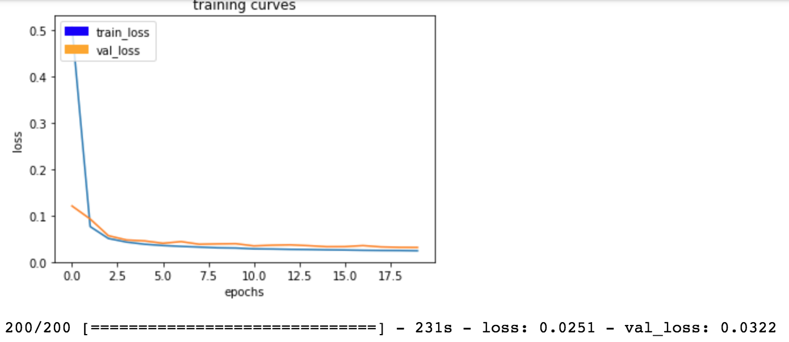

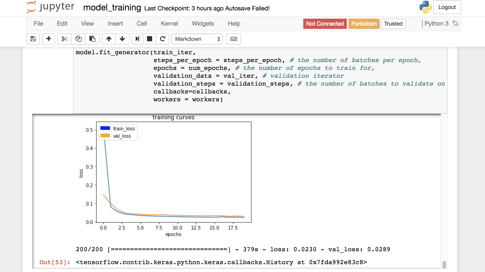
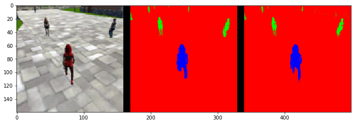
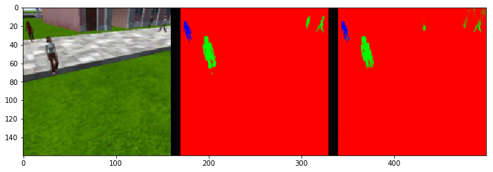
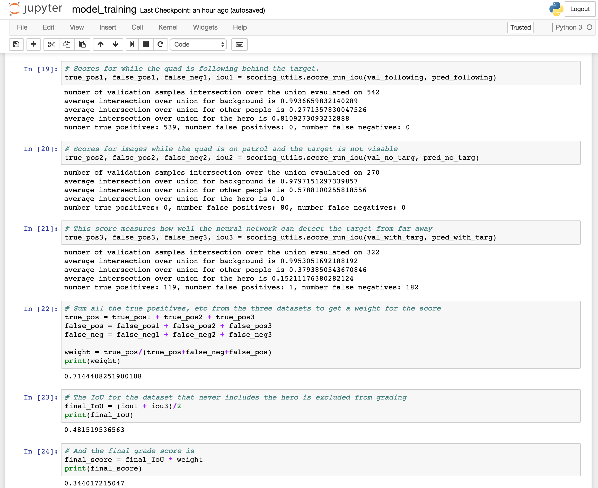
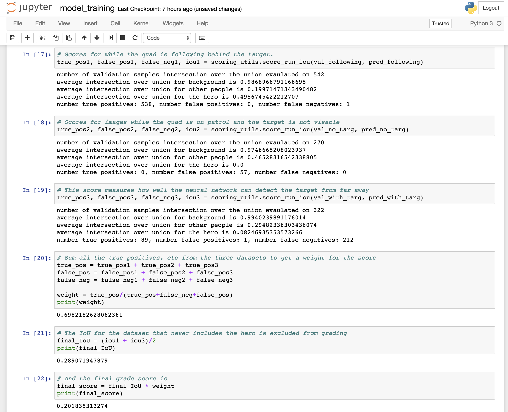
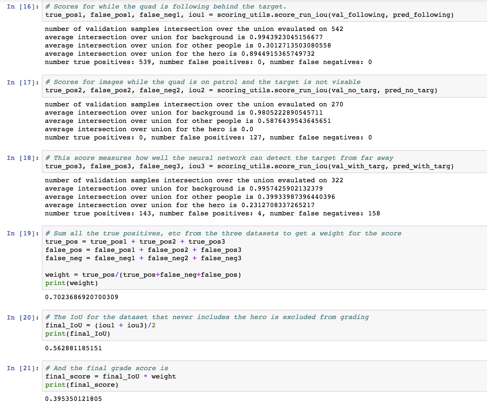
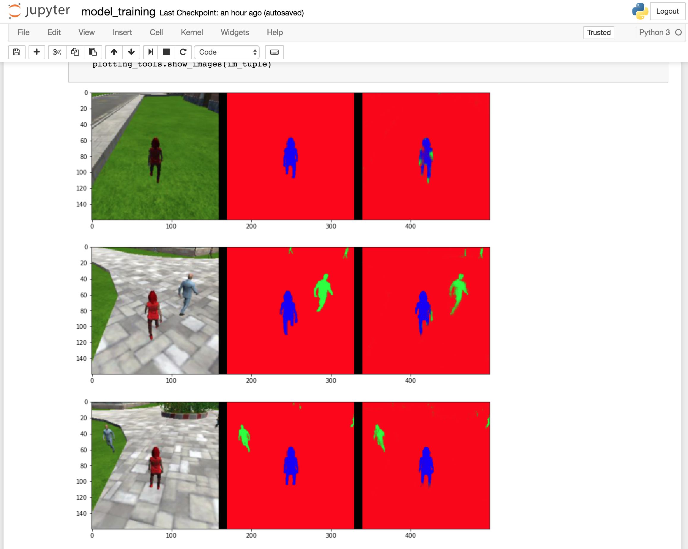
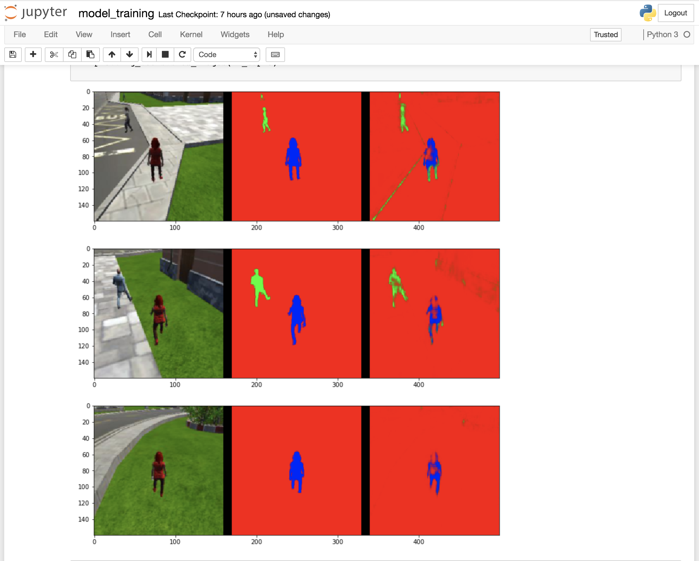
