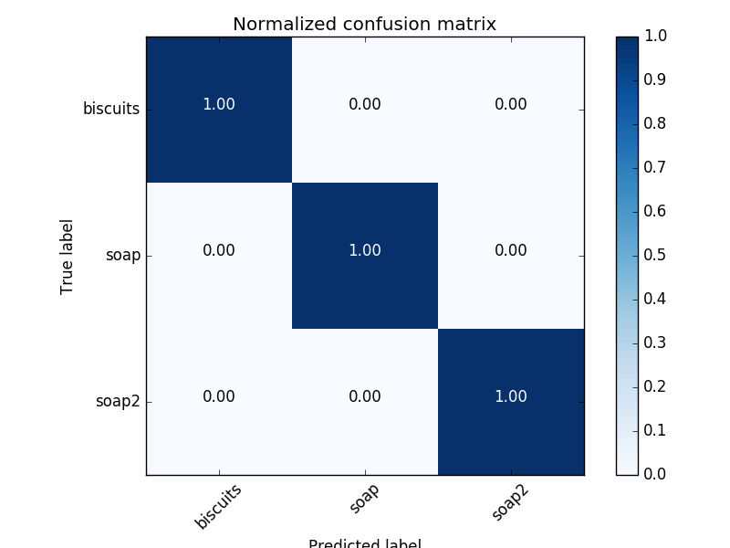
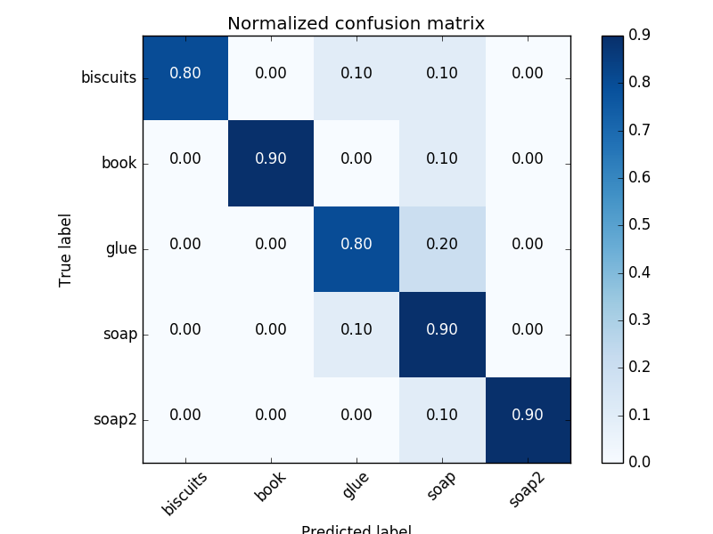
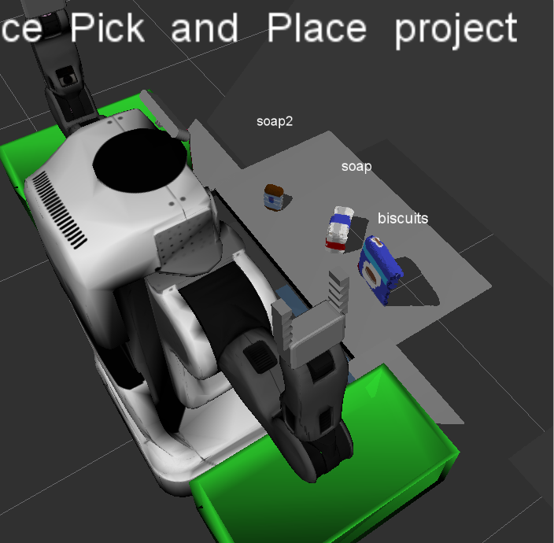
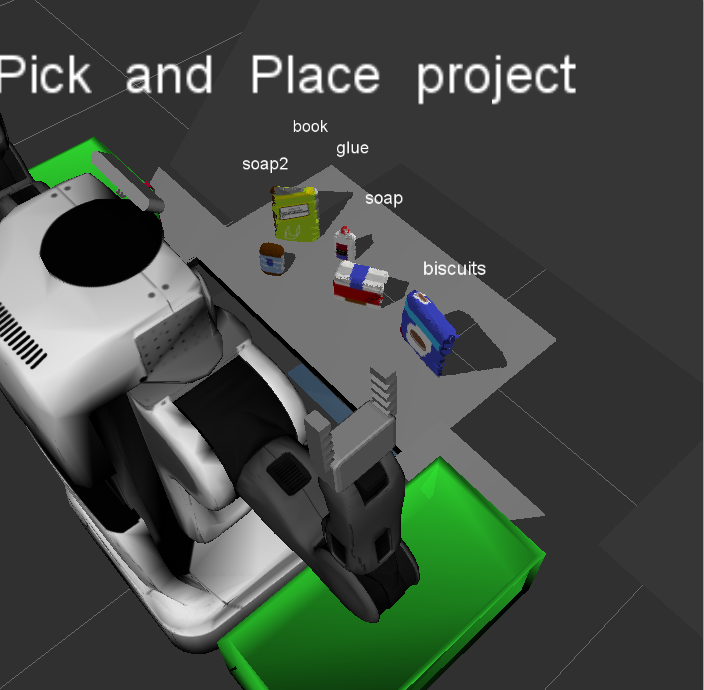
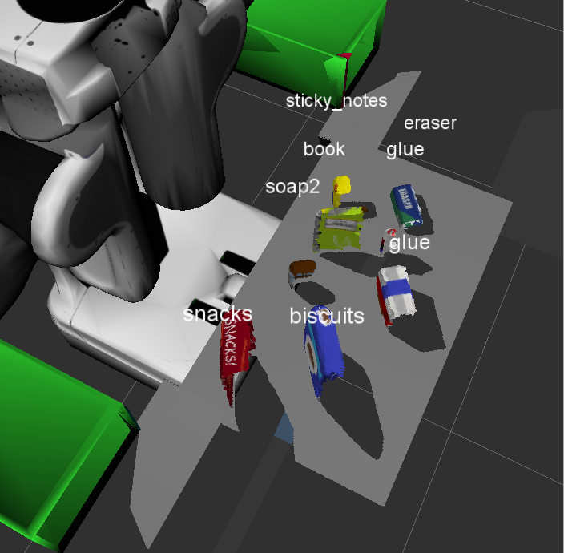

<header>
    <h1>
        Perception Project Writeup
    </h1>
</header>

<!-- TOC -->

- [Exercise 1 steps - pipeline for filtering input point cloud data](#exercise-1-steps---pipeline-for-filtering-input-point-cloud-data)
- [Exercise 2 steps - clustering segmentation](#exercise-2-steps---clustering-segmentation)
- [Exercise 3 steps - object detection](#exercise-3-steps---object-detection)
- [Pick and Place Setup](#pick-and-place-setup)

<!-- /TOC -->

# Exercise 1 steps - pipeline for filtering input point cloud data

One desires to reduce the amount of data that the classification model has to digest. The original point cloud data is dense. In order to downsample, the first step was to apply voxel grid downsampling, defined as:

```python
def voxel_downsample(cloud, leaf_size=0.01):
    voxel_filter = cloud.make_voxel_grid_filter()
    voxel_filter.set_leaf_size(leaf_size, leaf_size, leaf_size)
    return voxel_filter.filter()
```

and applied in the `pcl_callback` with its default `leaf_size`.

```python
def pcl_callback(pcl_msg):
    rospy.logdebug('inside pcl_callback')
    # Callback function for your Point Cloud Subscriber
    cloud = ros_to_pcl(pcl_msg)
    # -------------------------------------------------------------------
    # Exercise 2 pipeline - filtering and clustering w/o object detection
    # -------------------------------------------------------------------
    cloud = voxel_downsample(cloud)
    # (...)
```

Next, there is a region of interest which are just the objects on the table. The original stream of point cloud data is the field of vision of the pr2_robot. But we are only interested in the objects on top of the table (so, we apply a filter on the z axis); and we are not interested in the box corners at the periphery of robot's field of view (so, restriction on the y axis). These are the passthrough filters, defined as:

```python
def passthrough_filter(cloud, axis, lower, upper):
    pt_filter = cloud.make_passthrough_filter()
    pt_filter.set_filter_field_name(axis)
    pt_filter.set_filter_limits(lower, upper)
    return pt_filter.filter()
```

and applied in the `pcl_callback` function as:

```python
def pcl_callback(pcl_msg):
    # (...)
    cloud = passthrough_filter(cloud, 'z', .6, 1.1)
    cloud = passthrough_filter(cloud, 'y', -.4, .4)
    # (...)
```

As there is some noise coming from the sensor (similar to suspended dust around the object), it is necessary to clean this data for any form of statistical analysis or applying a model. For this purpose, we use a statistical outlier detector, which analyzes a neighborhood of k neighbors, computes the mean distance of those k neighbors, and any point lying in a distance greater than that some fraction of the standard deviation to any other point is considered an outlier. In code, such filter looks like:

```python
def outlier_filter(cloud, mean_k=50, sd=1.0):
    outlier_filter = cloud.make_statistical_outlier_filter()
    # #neighboring points to analyze for any given point
    outlier_filter.set_mean_k(mean_k)
    # any point with mean distance > global(mean_dist+sdev) = outlier
    outlier_filter.set_std_dev_mul_thresh(sd)  # sd aka threshold scale factor
    return outlier_filter.filter()
```

and applied with the following values

```python
def pcl_callback(pcl_msg):
    # (...)
    cloud = outlier_filter(cloud, mean_k=25, sd=.05)
    # (...)
```

The values were found after some trial and error, and some visual feedback to estimate the relevant number of neighbors. Still, not all of the "dust" was eliminated. Finally, one wishes for seperating the table from the objects, and for that there's RANSAC plane fitting, defined as:

```python
def ransac_segment(cloud, distance_thresh=0.01, model_type=pcl.SACMODEL_PLANE):
    # RANSAC Plane Segmentation :: detect the table
    seg = cloud.make_segmenter()
    seg.set_model_type(model_type)
    seg.set_method_type(pcl.SAC_RANSAC)
    seg.set_distance_threshold(distance_thresh)
    inliers, _ = seg.segment()  # inlier indices, model coefficients
    # Extract inliers and outliers
    inlrs = cloud.extract(inliers, negative=False)
    outlrs = cloud.extract(inliers, negative=True)
    return inlrs, outlrs
```

note that the `model_type` corresponds to a plane, meaning that the inliers correspond to a cluster shaperd like a flat board. As such, the variables in the callback function are named after this concept and the context of our perception problem scene:

```python
cloud_table, cloud_objects = ransac_segment(cloud)
```
    

# Exercise 2 steps - clustering segmentation

At this point, we have the different tabletop objects seperated from the environment (i.e. the table for example). However, in terms of data, they are not seperated, they are bundled together into a single object, `cloud_objects`. In order to seperate them, and thus prepare the data for classification, we need to cluster the current unique group of point cloud data into seperate objects (or groups of point cloud data, if you will).

```python
white_cloud = XYZRGB_to_XYZ(cloud_objects)  # pcloud w/ only spatial info
cluster_indices = euclidean_cluster(white_cloud)
```
where `euclidean_cluster` is

```python
def euclidean_cluster(white_cloud, cluster_tolerance=0.03,
                      min_cluster_size=30,
                      max_cluster_size=1200):
    # Euclidean Clustering
    tree = white_cloud.make_kdtree()
    ec = white_cloud.make_EuclideanClusterExtraction()
    ec.set_ClusterTolerance(cluster_tolerance)
    ec.set_MinClusterSize(min_cluster_size)
    ec.set_MaxClusterSize(max_cluster_size)
    ec.set_SearchMethod(tree)  # search the kdtree for clusters
    # extract indices for each of the discovered clusters
    cluster_indices = ec.Extract()
    return cluster_indices
```

In short, the white_cloud has to be turned into a different seach space - a kdtree. The `*_cluster_size`s set the lower and upper limit on the number of points that we want for each cluster. The default values were found to work the best across all 3 different pick-list scenarios.

After that, each of the clusters were assigned its own color at random with the help of the provided helper function, as follows

```python
color_cluster_point_list = make_color_masks(cluster_indices, white_cloud)
cloud_cluster = pcl.PointCloud_PointXYZRGB()  # new empty point cloud
# whole new point cloud with colored points respective to each cluster
cloud_cluster.from_list(color_cluster_point_list)  # fill in
```

# Exercise 3 steps - object detection

This section of the pipeline was bundled into a single function, `classify_clusters(cluster_indices, cloud_objects, white_cloud)`. The function, and the necessary variables are set up as

```python
detected_objects_labels, detected_objects = classify_clusters(cluster_indices, cloud_objects, white_cloud)
```

where `classify_clusters` includes the provided template code for labelling each of the clusters. The labbeling comes from the prediction of a previously trained model, using `train_svm.py` from the `sensor_stick` package. The features of the data that are fed into the svm were captured with the functions `compute_color_histograms` and `compute_normals_histograms`

```python
def compute_color_histograms(cloud, using_hsv=True, nbins=32):
    # Compute histograms for the clusters
    point_colors_list = []
    # Step through each point in the point cloud
    for point in pc2.read_points(cloud, skip_nans=True):
        rgb_list = float_to_rgb(point[3])
        if using_hsv:
            point_colors_list.append(rgb_to_hsv(rgb_list) * 255)
        else:
            point_colors_list.append(rgb_list)
    # Populate lists with color values
    channel_1_vals = []
    channel_2_vals = []
    channel_3_vals = []
    for color in point_colors_list:
        channel_1_vals.append(color[0])
        channel_2_vals.append(color[1])
        channel_3_vals.append(color[2])
    # Compute histograms
    hist_a = np.histogram(channel_1_vals, bins=nbins, range=(0, 256))
    hist_b = np.histogram(channel_2_vals, bins=nbins, range=(0, 256))
    hist_c = np.histogram(channel_3_vals, bins=nbins, range=(0, 256))
    # Concatenate and normalize the histograms
    hist_features = np.concatenate((hist_a[0], hist_b[0], hist_b[0])).astype(np.float64)
    normed_features = hist_features / np.sum(hist_features)
    return normed_features
```

```python
def compute_normal_histograms(normal_cloud, nbins=32):
    norm_x_vals = []
    norm_y_vals = []
    norm_z_vals = []
    for norm_component in pc2.read_points(normal_cloud,
                                          field_names = ('normal_x', 'normal_y', 'normal_z'),
                                          skip_nans=True):
        norm_x_vals.append(norm_component[0])
        norm_y_vals.append(norm_component[1])
        norm_z_vals.append(norm_component[2])
    # Compute histograms of normal values (just like with color)
    hist_x = np.histogram(norm_x_vals, bins=nbins)
    hist_y = np.histogram(norm_y_vals, bins=nbins)
    hist_z = np.histogram(norm_z_vals, bins=nbins)
    # Concatenate and normalize the histograms
    hist_features = np.concatenate((hist_x[0], hist_y[0], hist_z[0])).astype(np.float64)
    normed_features = hist_features / np.sum(hist_features)
    return normed_features
```

Some remarks regarding capture of features:
- default number of bins for any of the histograms is 32. However, I decided to reduce dimensionality to 16 bins on normals for pick-lists 2 and 3. I verified an improvement over the default value and stuck with it. The range of the normals, as far as I could verify, was between -1 and 1, and 32 divisions of this range seemed excessive.
-  the range of the normal's histograms was unspecified, taking min and max found of the data.

With the data collected, the svm's for the three different scenarios were trained using the provided `train_svm.py`. For scenario 1, it sufficed to use a linear kernel; for the remaining pick-list scenarios, a sigmoid kernel was picked as it produced better results. The normalized confusion matrices for each of the three scenarios follow:

<center>
    <!-- If you need any of these bigger, adjust the width to your preference -->
    
    
    
</center>

with these trained svm models, object detection code follows the provided template that calls the saved models to predict to which class a new instance belongs to.

# Pick and Place Setup

This functionality is implemented by the `pr2_mover` function. Essentially, it finds matches between the detected objects and the items in the pick list, proceeds to calculate the centroids and stores the data to a service message. Before calling this function however, a hard-code logic was added to the script, so as to prevent suboptimal classification. The trained models often time confused some objects, leading to repeated classifications - and in the pick-lists, no two items are the same. Using this problem-specific knowledge, pr2_mover is not called until the classification results in a list of non-repeated items.

```python
if len(set(detected_objects_labels)) == len(detected_objects_labels):
        print 'able to identify all unique objects. proceeding to place objects'
        try:
            pr2_mover(detected_objects)
        except rospy.ROSInterruptException:
            rospy.logerr('rospy.ROSInterruptException upon calling pr2_mover() :(')
            pass
    else:
        print 'still waiting until finding all unique objects...'
```

The `set` function returns the non-repeated list. With this hack in place, only in pick-list 3 scenario does it take a bearable while until finding the classification we need. To end this writeup, herewith are the screenshots of the classification in action.

- pick-list 1
<center>
    <!-- If you need any of these bigger, adjust the width to your preference -->
    
</center>
- pick-list 2
<center>
    <!-- If you need any of these bigger, adjust the width to your preference -->
    
</center>
- pick-list 3
<center>
    <!-- If you need any of these bigger, adjust the width to your preference -->
    
</center>
