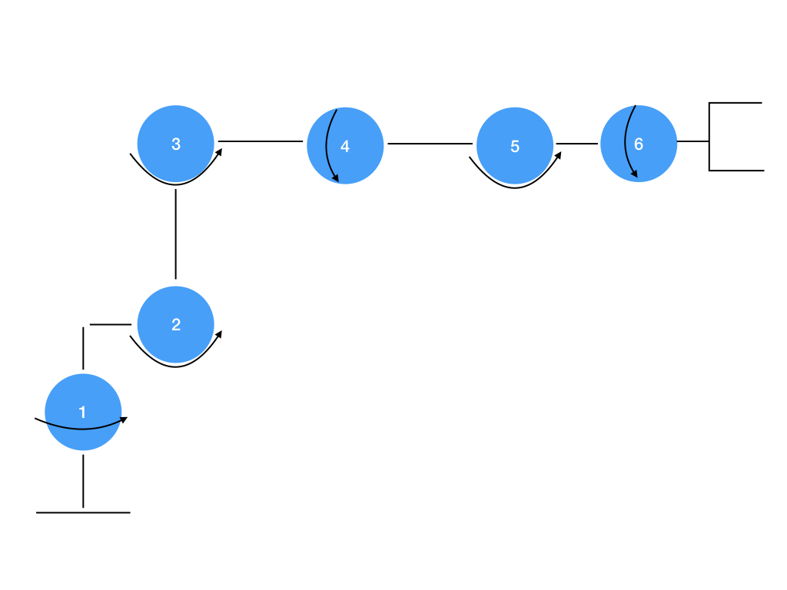
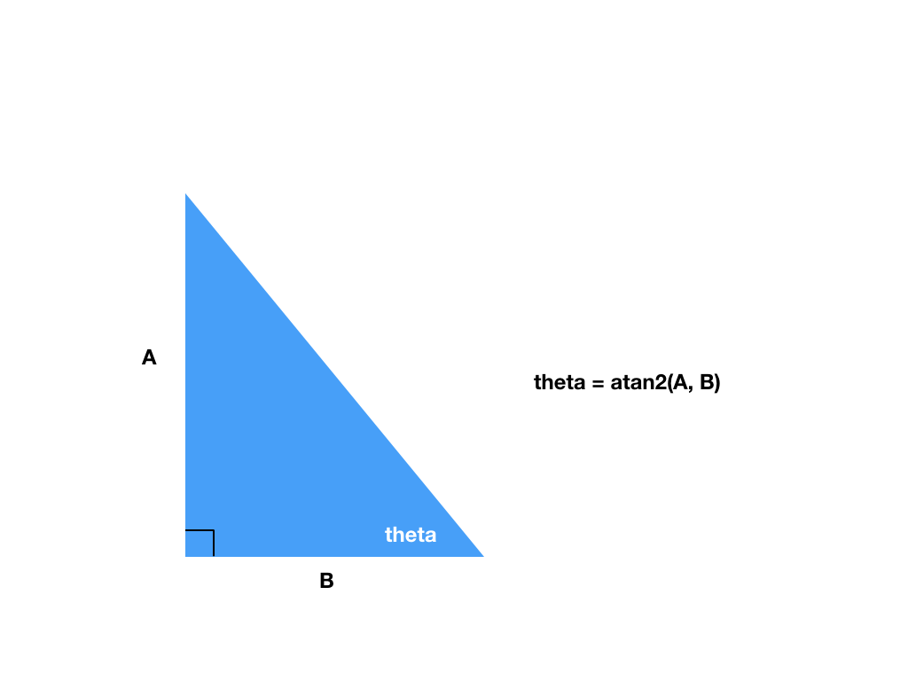

## Project: Kinematics Pick & Place
---

## [Rubric](https://review.udacity.com/#!/rubrics/972/view) Points
### Here I will consider the rubric points individually and describe how I addressed each point in my implementation.  

---
### Writeup / README

#### 1. Provide a Writeup / README that includes all the rubric points and how you addressed each one.  You can submit your writeup as markdown or pdf.  

You're reading it!

### Kinematic Analysis
#### 1. Run the forward_kinematics demo and evaluate the kr210.urdf.xacro file to perform kinematic analysis of Kuka KR210 robot and derive its DH parameters.

Following the instructions in the KR210 Forward Kinematics lectures, I was able to derive all of the DH parameters for the kinematic structure of the Kuka KR210 robot.

 i | alpha(i-1) | a(i-1) | d(i-1)       | theta_i
-- | ---        | ---    | ---          | ---
 1 | 0          | 0      | 0.33 + 0.42  | theta_1
 2 | -pi/2      | 0.35   | 0            | theta_2 - pi/2
 3 | 0          | 1.25   | 0            | theta_3
 4 | -pi/2      | -0.054 | 0.96 + 0.54  | theta_4
 5 | pi/2       | 0      | 0            | theta_5
 6 | -pi/2      | 0      | 0            | theta_6
 7 | 0          | 0      | 0.193 + 0.11 | theta_7

How I got the translation values in the DH parameter table:

Links | type of transform              | measured from
---   | ---                            | ---
0->1  | translation along z axis       | sum of z translation for joint1 and joint 2
1->2  | translation along x axis       | x translation for joint2
2->3  | translation along z axis       | z translation for joint3
3->4  | translation along z and x axis | z translation for joint4 and sum of x translation for joint4 and joint5
4->5  |                                |
5->6  |                                |
6->EE | translation along x axis       | sum of x translation for joint6 and gripper_joint



#### 2. Using the DH parameter table you derived earlier, create individual transformation matrices about each joint. In addition, also generate a generalized homogeneous transform between base_link and gripper_link using only end-effector(gripper) pose.
Each transform matrix follows the same format. If we store the alpha, a, d, and theta values in arrays indexed `i` from 0 to 6, we can generate matrices using the following code:
```python
Matrix([
    [ cos(q[i]),                 -sin(q[i]),                0,              a[i]                  ],
    [ sin(q[i]) * cos(alpha[i]), cos(q[i]) * cos(alpha[i]), -sin(alpha[i]), -sin(alpha[i]) * d[i] ],
    [ sin(q[i]) * sin(alpha[i]), cos(q[i]) * sin(alpha[i]), cos(alpha[i]),  cos(alpha[i]) * d[i]  ],
    [ 0,                         0,                         0,              1]
])
```

To put the generated matrices for the transform between each joint, we can calculate our matrix as
```python
T0_EE = transform_matrices[0]
  for i in range(1, 7):
      T0_EE = T0_EE * transform_matrices[i]
```

which gives us a single matrix indicating the transformation between the base link and the gripper link.

#### 3. Decouple Inverse Kinematics problem into Inverse Position Kinematics and inverse Orientation Kinematics; doing so derive the equations to calculate all individual joint angles.


For calculating theta1, theta4, theta5, and theta6, we know that the angle is part of a right triangle whose leg lengths we already know. Since we just have a right triangle, we know that the tangent of the angle we need to calculate is equal to the ratio of the two leg lengths that know as well. To get the angle, then, we can simply use `atan2` to calculate the inverse tangent with the resulting angle in the correct quadrant based on the signs of the two parameters.

theta1 controls the yaw movement, so we can calculate it as `atan2(WC[1], WC[0])`

Once we have calculated R3_6, we can calculate theta4, theta5, and theta6 using the same method of calculating the inverse tangent based on legs of the right triangles formed by the links. Because there exist two solutions for the group of theta4, theta5, and theta6, we first calculate a value for theta5 and then use the quadrant of that angle to select the quadrant for theta4 and theta6.

```python
theta5 = atan2(sqrt(R3_6[0, 2] * R3_6[0, 2] + R3_6[2, 2] * R3_6[2, 2]), R3_6[1, 2])

if sin(theta5) < 0:
    theta4 = atan2(-R3_6[2, 2], R3_6[0, 2])
    theta6 = atan2(R3_6[1, 1], -R3_6[1, 0])
else:
    theta4 = atan2(R3_6[2, 2], -R3_6[0, 2])
    theta6 = atan2(-R3_6[1, 1], R3_6[1, 0])
```

For theta2 and theta3, however, we must make calculate the angles using the law of cosines, since the translations provide us the three sides of a transformation triangle and we need to know the angles within that triangle to calculate our theta values.

To make this calculation, we first calculate the three sides of the triangle by combining the link lengths and transform values.

```python
side_a = sqrt(dh_params[d[3]] ** 2 + dh_params[a[3]] ** 2)
side_c = dh_params[a[2]]
side_b = sqrt((sqrt(WC[0] ** 2 + WC[1] ** 2) - dh_params[a[1]]) ** 2 + (WC[2] - dh_params[d[0]]) ** 2)
```

With all three sides of the triangle, we can apply the law of cosines to get us the three angles A, B, and C.

```python
angle_a = acos((side_b ** 2 + side_c ** 2 - side_a ** 2) / (2 * side_b * side_c))
angle_b = acos((side_a ** 2 + side_c ** 2 - side_b ** 2) / (2 * side_a * side_c))
angle_c = acos((side_a ** 2 + side_b ** 2 - side_c ** 2) / (2 * side_a * side_b))
```

With these angles, we can calculate the values of theta2 and theta3 since the sum of the theta values, triangle angles, and inverse tangent from the transform add up to 90 degrees. One additional adjustment we must make for theta3 is to account for the sag in the fourth link, which we do by adding back `atan2(abs(dh_params[a[3]]), dh_params[d[3]])`

```python
theta2 = pi/2 - angle_a - atan2(WC[2] - dh_params[d[0]], sqrt(WC[0] ** 2 + WC[1] ** 2) - dh_params[a[1]])
theta3 = pi/2 - angle_b - atan2(abs(dh_params[a[3]]), dh_params[d[3]])
```

### Project Implementation
#### 1. Fill in the `IK_server.py` file with properly commented python code for calculating Inverse Kinematics based on previously performed Kinematic Analysis. Your code must guide the robot to successfully complete 8/10 pick and place cycles. Briefly discuss the code you implemented and your results.
To reduce duplicate code in my inverse kinematics implementation, I decided to store the symbols for alpha, a, d, and q in arrays instead of individual variables, which allowed me to perform tasks such as generating each transformation matrix through iteration over those arrays instead of writing duplicate code with different variables used for each.

Another change I made was to use the transposed R0_3 matrix for inverse kinematics instead of using the original code that tried to solve it using a library method, which allowed me to gain more accurate inverse kinematics results.

When run with the Gazebo simulator, the code is able to perform the task almost each time, picking up the can and dropping it into the goal (see pick-place-demonstration.mov for example runs). One improvement to make would be to make the arm motions more continuous, instead of slowing down to each waypoint.

To implement the solution to this exercise, I used the Atom text editor and ran tests through VMWare Fusion on a Mac.
